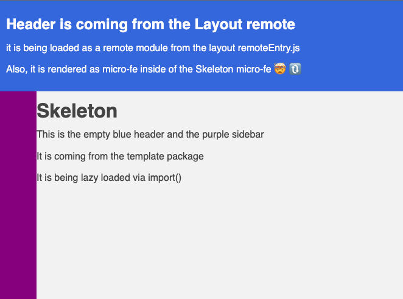

## What's inside?

This repo is an experiment with single-spa + module-federation.
The idea is to prove that is possible to load a remote module and render it using single-spa.

The `apps/shell` folder is the **starting point**, it will load the first App start single-spa engine.

<center>



</center>

### Apps, Packages, and Remotes

- `apps/shell`: An orchestrator for loading remote packages and single-spa apps.
- `packages/remote-loader`: A Standard npm package for loading federated modules as consumable values
- `remotes/layout`: A remote module with layout components being exposed as single-spa applications

### Develop

```bash
yarn run dev
```

Access it at: http://localhost:3000

The local dev task will:

1. wait for the build of all packages to complete
1. run in parallel:
   1. shell on port `3000`
   1. all remotes in different ports (defined on the `dev` task in their respective package.json)

The packages are built only once during the `dev` task.
If you want to run `watch` on all of them, just run on the root level:

```bash
yarn watch
```

This will run `watch` on all packages and keep then running in parallel.  
If you need to `watch` an specific package, you can do it by running:

```bash
cd packages/[package-name]
yarn run watch
```

### Production Build

To build all apps, remotes, and packages, on the root level:

```bash
yarn run build
```

## References:

- [Turbo Repo](https://turborepo.org/docs)
- [single-spa](https://single-spa.js.org/docs/getting-started-overview)
- [single-spa React](https://single-spa.js.org/docs/ecosystem-react/) (helper to create spa lifecycles like mount/unmount)
